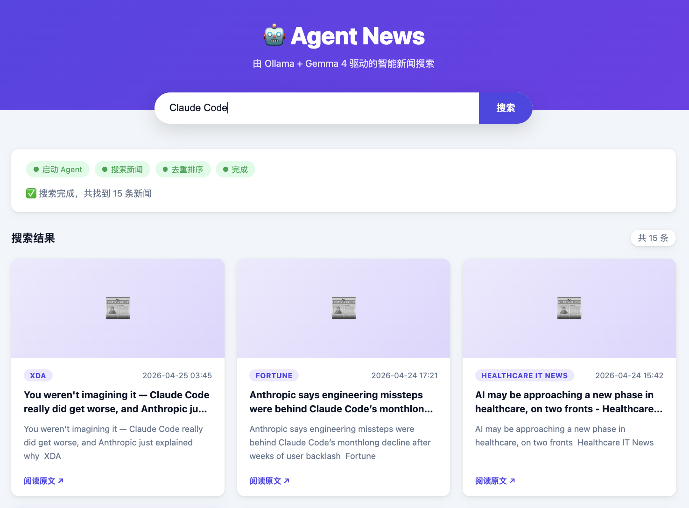

# Agent News — Intelligent News Search

An AI-powered news search application driven by **Ollama + Gemma 4 (local LLM)**, built with a decoupled frontend-backend architecture.

Users input a topic of interest, and the Agent autonomously plans its search strategy, calls Google News RSS to fetch the latest news, deduplicates and sorts the results by time, then streams back the Top 15 news items in real time. Each item includes title, summary, source, and publication time.

---

## Screenshot



The search box supports both Chinese and English input. After clicking "Search", a real-time progress bar appears at the top of the page showing each stage: **Launching Agent → Searching News → Deduplicating & Sorting → Done**. Results are rendered as a card grid, with each card showing:
- News title and summary
- Source outlet (e.g. XDA, Fortune, Healthcare IT News)
- Exact publication time
- "Read Original" link to the source article

All content is streamed via SSE — cards appear one by one as each result arrives, with no waiting for the full batch.

---

## Features

- **Agent-driven**: The local LLM autonomously decides on search keyword variations, using multi-round searches for more comprehensive coverage
- **Streaming response**: Based on SSE (Server-Sent Events), news is displayed as it is searched — no need to wait for the entire process to complete
- **No rate limits**: Uses Google News RSS — no API key required, no rate limiting
- **Automatic deduplication**: Dual-dimension deduplication based on URL and title, filtering out duplicate republished news
- **Time-based sorting**: All results are sorted in descending order by publication time, with the newest news shown first
- **Dual-end logging**: Frontend and backend logs are written to separate files for easier debugging
- **Fully local execution**: The model runs on local Ollama — no data leaves your machine

---

## Tech Stack

| Layer | Technology | Description |
|-------|------------|-------------|
| Frontend | Native HTML / CSS / JavaScript | No build tools required — just open in a browser |
| Backend | Python + FastAPI | Provides REST API and SSE streaming interface |
| AI Model | Ollama + Gemma 4:31b | Runs locally, responsible for Tool Calling decisions |
| News Source | Google News RSS + feedparser | Free, no registration, no rate limits |

---

## Project Structure

```
agent-news/
├── frontend/
│   ├── index.html      # Page structure: search box, progress card, news card grid
│   ├── style.css       # Styles: responsive layout, card animations, progress steps
│   └── app.js          # Frontend logic: SSE parsing, card rendering, log reporting
├── backend/
│   ├── main.py         # FastAPI entry: route definitions, logging configuration
│   ├── agent.py        # Agent main loop: LLM tool calls, SSE event generation
│   ├── tools.py        # Tool functions: search, dedupe, sort, format
│   └── requirements.txt
├── logs/               # Auto-created at runtime
│   ├── backend.log     # Backend log (includes Agent execution process)
│   └── frontend.log    # Frontend log (user actions and request process)
└── README.md
```

---

## Quick Start

### Prerequisites

- Python 3.9+
- [Ollama](https://ollama.com) installed and running
- Gemma 4 model pulled

```bash
# Confirm Ollama is running
ollama serve

# Pull the model (if not already pulled)
ollama pull gemma4:31b

# Confirm the model is ready
ollama list
```

### Install Dependencies

```bash
cd agent-news/backend
pip install -r requirements.txt
```

### Start the Backend

```bash
python main.py
# Service starts at http://localhost:8000
```

### Open the Frontend

Simply open `frontend/index.html` in your browser — no build steps required.

---

## Usage

1. Enter a topic of interest in the search box (Chinese or English both supported)
2. Click "Search" or press Enter
3. Observe the progress card. The Agent goes through the following stages:
   - **Launching Agent** → LLM begins planning the search strategy
   - **Searching News** → Calls Google News RSS (may be multiple rounds)
   - **Deduplicating & Sorting** → Filters duplicates, sorts by time
   - **Done** → All news cards rendered
4. Click a news title or "Read Original" to jump to the source article

---

## Agent Workflow

```
User inputs topic
    │
    ▼
[LLM Reasoning] Gemma 4 receives topic and decides search strategy
    │
    ├──► Calls search_news("topic")
    ├──► Calls search_news("topic latest 2026")
    └──► Calls search_news("topic news")
              │
              ▼ (each search result appended to message history)
    [LLM Reasoning] Determines whether results are sufficient → calls finish_search
              │
              ▼
       Post-processing: dedupe → sort by time → take top 15
              │
              ▼
       SSE streams each news item to frontend (real-time rendering)
```

---

## Logging

After the backend starts, the `logs/` directory is auto-created:

| File | Content |
|------|---------|
| `backend.log` | Request reception, LLM call duration, tool execution results, dedup/sort details |
| `frontend.log` | User actions, SSE chunk stats, render record for each news item |

Max log file size is 5MB with automatic rotation, keeping up to 3 historical files.

**View live logs:**
```bash
# Tail the backend log
tail -f logs/backend.log

# Tail the frontend log
tail -f logs/frontend.log
```

---

## API Documentation

After starting the backend, visit [http://localhost:8000/docs](http://localhost:8000/docs) for auto-generated FastAPI interface documentation.

| Method | Path | Description |
|--------|------|-------------|
| POST | `/api/search` | Search news, returned via SSE stream |
| POST | `/api/log` | Receives frontend logs and writes to file |
| GET  | `/health` | Health check |

---

## FAQ

**Q: No response for a long time after searching?**

A: The Gemma 4:31b model is large, and the first LLM call may take 10–30 seconds, which is normal. You can check actual progress with `tail -f logs/backend.log`.

**Q: Zero results returned?**

A: Check whether your network can access `news.google.com`, or try switching to English keywords.

**Q: How do I switch to a different model?**

A: Modify the `MODEL` variable at the top of `backend/agent.py` to the name of any other model you have pulled.

---

## Development Notes

The backend runs with `reload=True` enabled — Python files will auto-reload on changes, no manual action required.

The frontend consists of pure static files — just refresh the browser after making changes.
